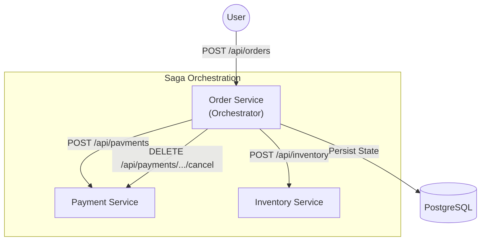

# High-Level Architecture

The Order Management System is composed of three primary microservices that interact using the **Saga Orchestration Pattern**. This ensures data consistency across distributed services without the need for two-phase commits.

## System Overview

The system uses an orchestrator-based approach where the **Order Service** manages the entire lifecycle of an order and coordinates with the **Payment** and **Inventory** services.

### Components

1.  **Order Service (Orchestrator)**:
    *   Exposes external REST APIs for order creation and tracking.
    *   Uses **Spring State Machine** to manage the lifecycle of each order.
    *   Persists order state in a **PostgreSQL** database.
    *   Coordinates forward and compensating transactions.

2.  **Payment Service (Worker)**:
    *   Stateless service that handles payment processing and refunds.
    *   Deterministic failure simulation for testing (fails on specific `orderId`).

3.  **Inventory Service (Worker)**:
    *   Stateless service that handles inventory reservation.
    *   Deterministic failure simulation for testing (fails on specific `orderId`).

## Architecture Diagram

## Transaction Flows

### 1. Happy Path (Success)
1.  **User** creates an order.
2.  **Order Service** sets state to `ORDER_CREATED` and saves to DB.
3.  **Order Service** triggers payment.
4.  **Payment Service** returns `Success`.
5.  **Order Service** updates state to `PAYMENT_COMPLETED`.
6.  **Order Service** triggers inventory reservation.
7.  **Inventory Service** returns `Success`.
8.  **Order Service** updates state to `ORDER_COMPLETED`.

### 2. Compensating Path (Rollback)
1.  **User** creates an order.
2.  **Order Service** triggers payment.
3.  **Payment Service** returns `Success`.
4.  **Order Service** triggers inventory reservation.
5.  **Inventory Service** returns `Failure`.
6.  **Order Service** triggers **Compensating Transaction**: Refund Payment.
7.  **Payment Service** refunds the payment.
8.  **Order Service** updates state to `ORDER_FAILED`.
