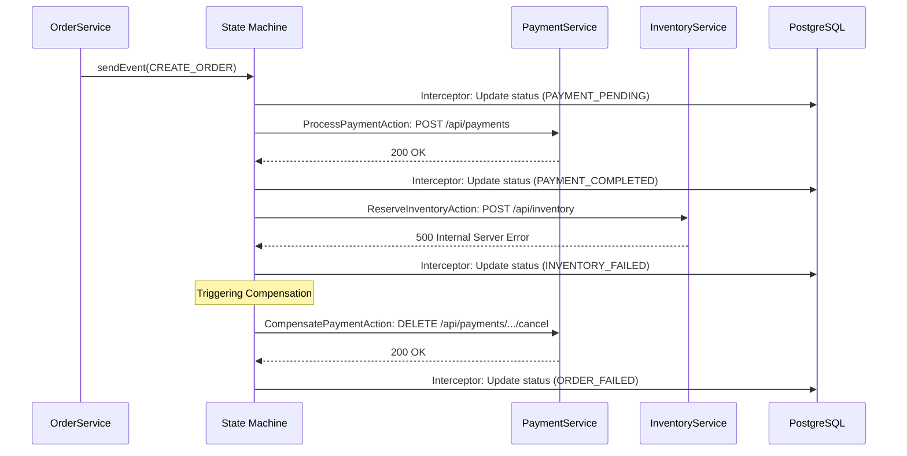

# Low-Level Architecture

This document dives into the internal implementation details of the **Order Service** and its integration with the **Saga Workers**.

## Internal Components (Order Service)

### 1. State Machine Engine
The core of the orchestration is built using **Spring State Machine 4.x**.

*   **`StateMachineConfig`**: Defines the states (`OrderState`), events (`OrderEvent`), and transitions.
*   **`OrderStateChangeInterceptor`**: A hook that persists state changes to the database *before* the machine moves to the next state, ensuring consistency between memory and disk.
*   **`StateMachineFactory`**: Provides isolated machine instances for each unique order.

### 2. Action Layer (The "Doers")
Actions are small, focused classes that execute during state transitions:
*   **`ProcessPaymentAction`**: Executes when moving from `ORDER_CREATED` → `PAYMENT_PENDING`. Uses `RestTemplate` to call the Payment Service.
*   **`ReserveInventoryAction`**: Executes when moving from `PAYMENT_COMPLETED` → `INVENTORY_PENDING`. Calls the Inventory Service.
*   **`CompensatePaymentAction`**: Executes during the rollback flow. Calls the Payment Service's refund endpoint.

### 3. Persistence Layer
*   **Entity**: `Order` with `String id`, `OrderState status`, etc.
*   **Repository**: `OrderRepository` (Spring Data JPA).

## Sequence Diagram (Compensating Transaction)

The following diagram shows the low-level sequence of events when an inventory reservation fails.



## Key Technical Patterns

### 1. Reactive Event Firing
To handle high load and prevent thread blocking, the system uses the **Project Reactor** (`Mono`) API.
```java
sm.sendEvent(Mono.just(msg)).subscribe();
```

### 2. Delay for Database Consistency
A 200ms delay is introduced in the `Action` classes before firing the next event. This ensures that the `OrderStateChangeInterceptor` has finished releasing the database lock on the `Order` record before the next transition begins.
```java
Mono.delay(Duration.ofMillis(200)).subscribe(t -> {
    context.getStateMachine().sendEvent(Mono.just(msg)).subscribe();
});
```

### 3. Decoupled Actions
Actions are isolated from the main `OrderService` to prevent circular dependencies. They interact with the machine directly via the `StateContext`.
